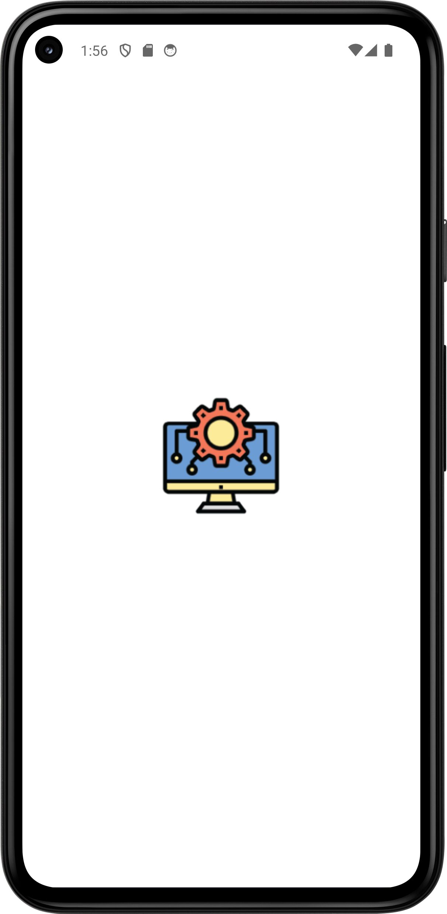
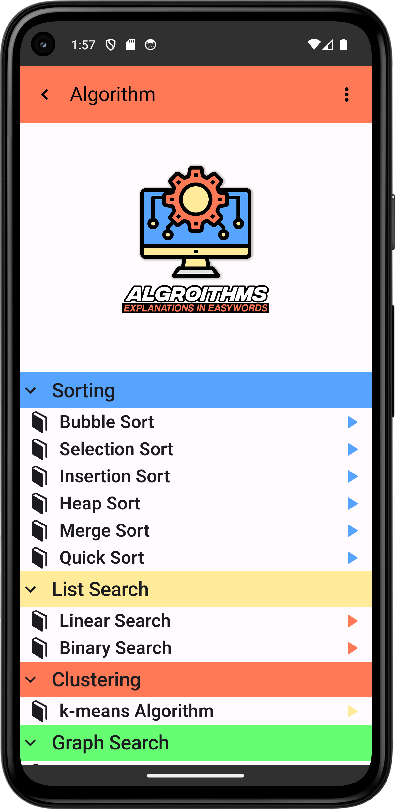
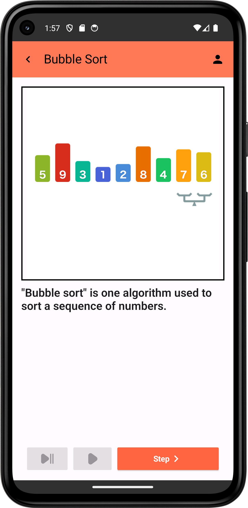
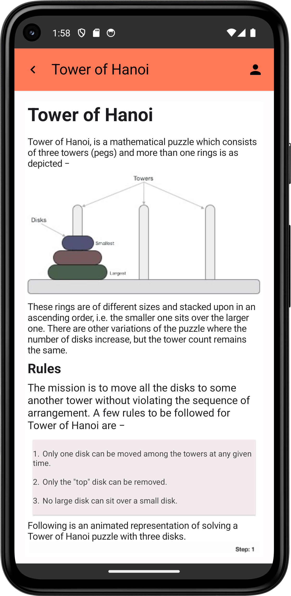
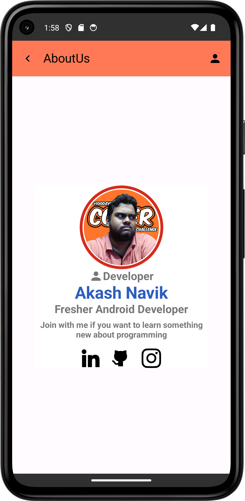

# Algorithm App

The Algorithm App is designed to help computer science students and IT professionals learn and practice data structures and algorithms (DSA) concepts. This app provides an interactive and user-friendly platform to explore various algorithms and understand their implementations.

## Features

- **Algorithm Visualizations:** Step-by-step visual representations of algorithms.
- **Interactive Learning:** Hands-on practice with various data structures and algorithms.
- **Resources and References:** Access to additional learning resources and references.

## Technology Stack

- **Jetpack Compose:** For building a modern, responsive user interface.
- **Kotlin:** The primary programming language used for Android development.
- **ViewModel:** For managing UI-related data in a lifecycle-conscious way.

## Getting Started
<h3>Prerequisites</h3>
    <ul>
        <li>Android Studio</li>
        <li>Basic knowledge of Android development and Kotlin</li>
    </ul>
    <h3>Clone the Repository</h3>
    <pre><code>git clone https://github.com/AkashNavik/AlgorithmApp.git</code></pre>
    <h3>Build and Run</h3>
    <ol>
        <li>Open the project in Android Studio.</li>
        <li>Sync Gradle and build the project.</li>
        <li>Connect your Android device or start an emulator.</li>
        <li>Run the app by clicking on the 'Run' button in Android Studio.</li>
    </ol>
    <h2>Application Perview </h2>
    
Perview Screen of Rock Paper Scissors Game:

    <ul>
        <li><h3>Splash Screen<h3> 
        
        </li>
        <li><h3>Main Screen </h3>
        
        </li>
        <li><h3>Visualizer Screen </h3>
          
        </li>
        <li><h3>Information Screen </h3>
          
        </li>
        <li><h3> My Info Screen </h3>
            
        </li>
    </ol>
    <h2>Contact</h2>
    
If you have any questions or need further assistance, please contact <strong>Akash Navik</strong> at <a href="akashnavik05@gmail.com">email</a>.
      Do CheckOut My Linked Profile <a href ="https://www.linkedin.com/in/akash-navik-38007617a/">Akash Navik</a>
    

